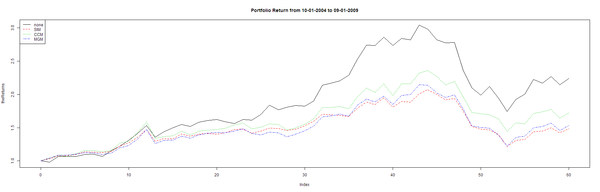
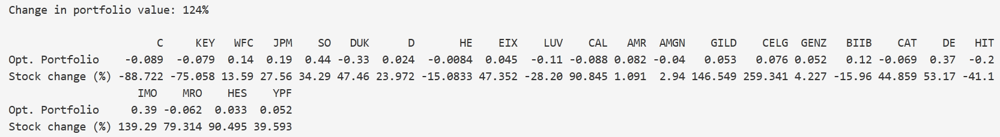

Stock Models and Optimal Portfolio Construction
========================================================
author: Fiona Yeung
date: May 22, 2015

Introduction
========================================================

The R package **stockPortfolio** is a quantitative approach to portfolio allocation among stocks. The package includes functions to download historical data from Yahoo Finance, build models, estimate optimal portfolios, and test portfolios.  

This project showcases some of the functionality included in the package by using two datasets, "stock99" (training set) and "stock04" (test set), that are included as part of the package. The project is deployed on RStudio's Shiny server [here](https://fionacyeung.shinyapps.io/Stock_Models_and_Optimal_Portfolio_Construction/).

See further details and references at the [stockPortfolio](http://cran.r-project.org/web/packages/stockPortfolio/stockPortfolio.pdf) package documentation on CRAN.

========================================================

**Stock Models**  
There are four model options included in the package: 1) no model, where a portfolio is selected based on empirical returns, variances, and covariances among the stocks 2) the single index model (SIM), 3) constant correlation model (CCM), and 4) the multigroup model (MGM). Further options to include or exclude individual stocks and to allocate the selected stocks equally within the associated industries are added to demonstrate user interactions using R Shiny.

**Optimal Portfolio Construction**  
After building a stock model, the user can then obtain an estimate of the optimal portfolio allocation among the stocks chosen and test the portfolios on the "stock04" dataset.

========================================================

After the user has made all the selections, the performance for the various models with optimal portfolio construction will be display and plotted when the "Submit" button is clicked. Live R code embedded in this presentation generated the sample plot below using the default data. The test period of 10-01-2004 to 09-01-2009 is used for all analyses (displayed as the day number in the test period on the x axis below). 

 

========================================================

The profit summary and allocation of the optimal portfolio with no model is shown on the application website, along with those from the user specified allocation for comparison. For example, the summary of the CCM model is shown below.

In the above figure, the profit from the test period is 124% (i.e. return = 2.24). The optimal allocation computed is shown in the row "Opt. Portfolio", where the allocation for all the stocks in the portfolio should sum to 1.0. Negative values represent short positions. The profit (or loss) of the individual stocks in the portfolio is shown in the "Stock change (%))" row. 
